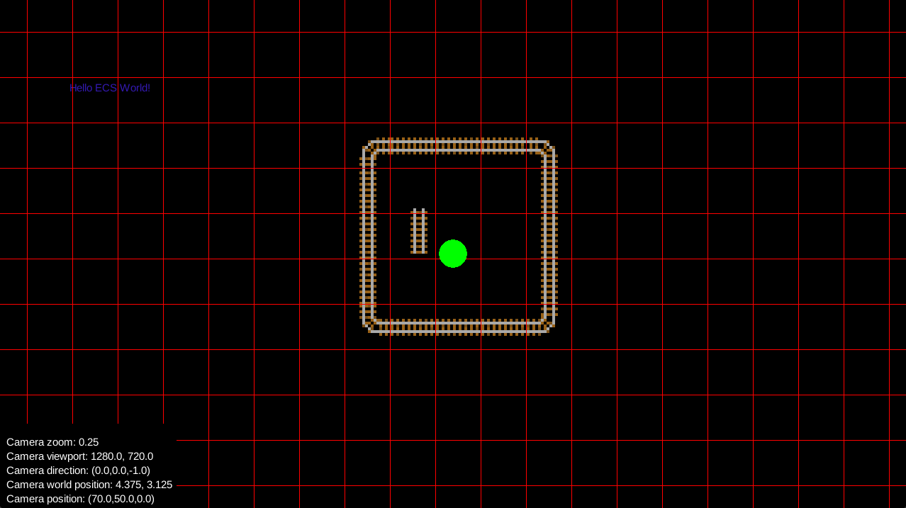

## Current 2D Version of Railventure

## Debug keys
- `←` `→` `↓` `↑` : Move camera
- `Scroll` : Zoom / Dezoom
- `F1` : Toggle debug mode
- `F2` : Toggle tiles borders
- `F3` : Toggle chunks borders

## Documentation

- [Game Design Document](https://docs.google.com/document/d/11n7iS0IGyN1e3w6MINMN4v4J-sQadCq4GiFhUPvfKh4/)
- [Project Management](https://trello.com/b/kmGSew56/railventure)